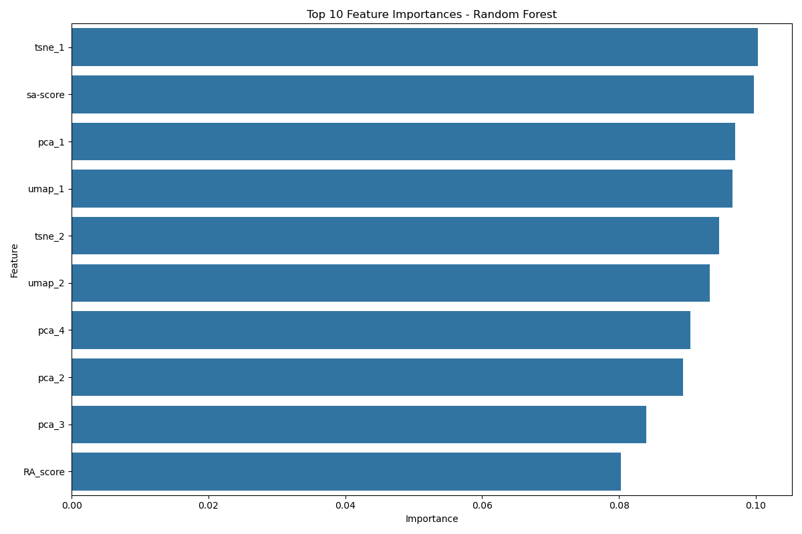
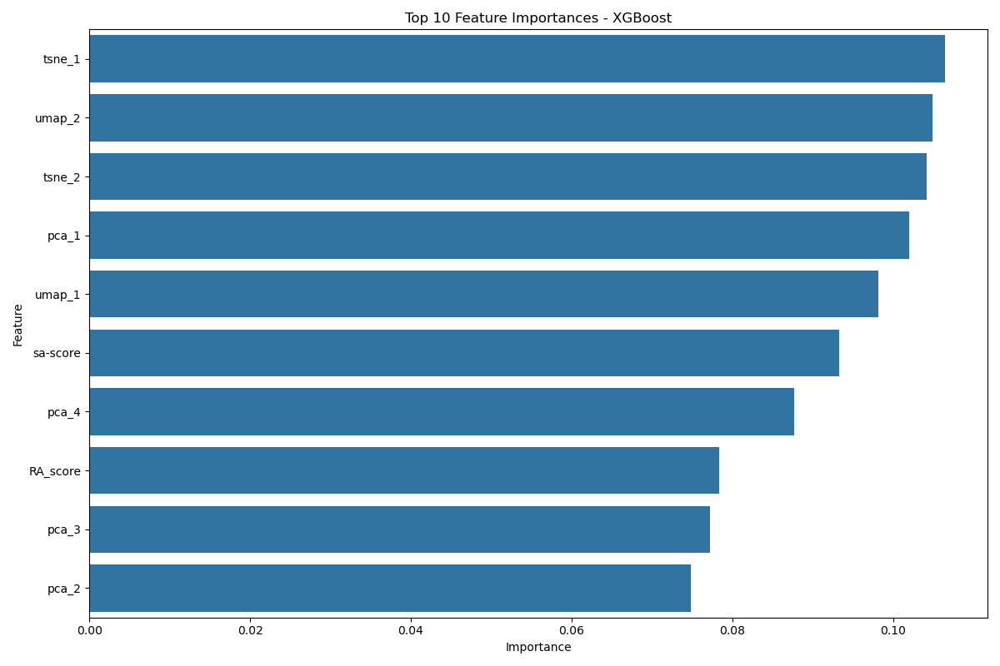
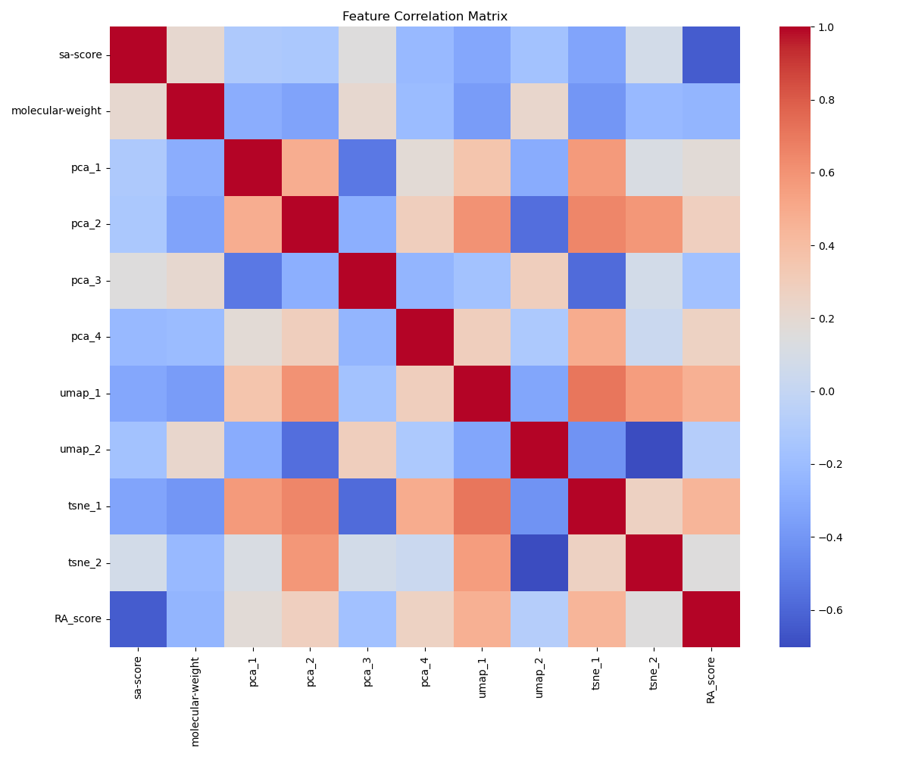
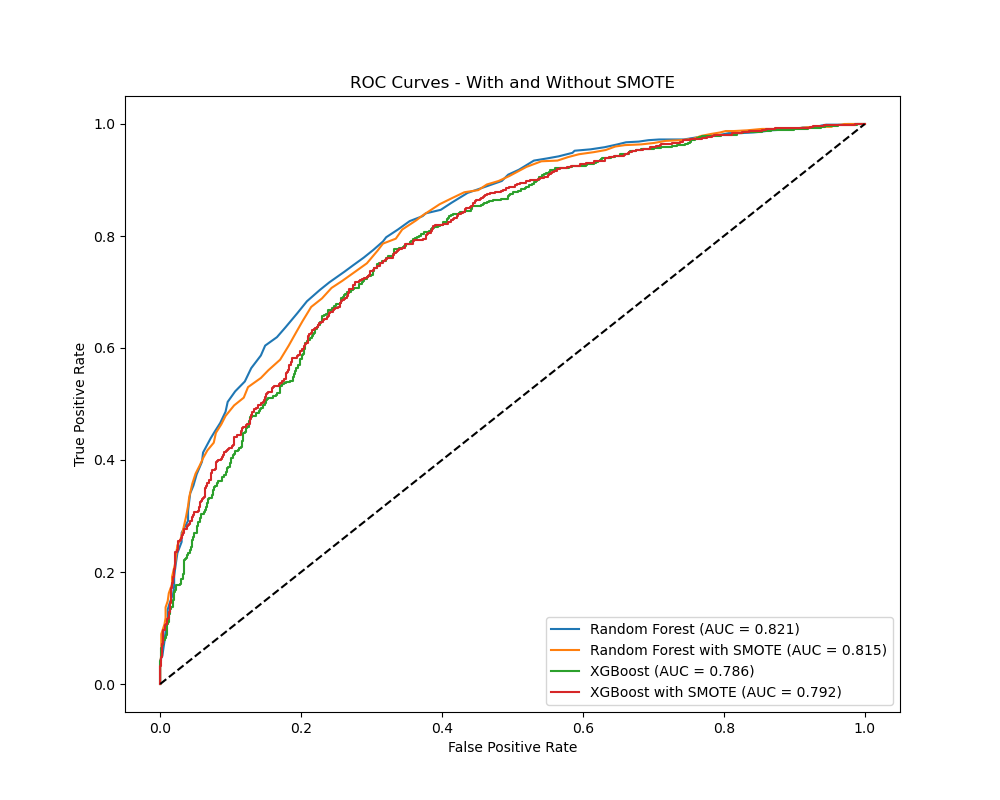
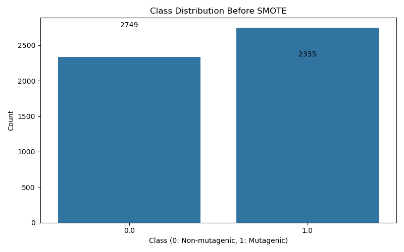
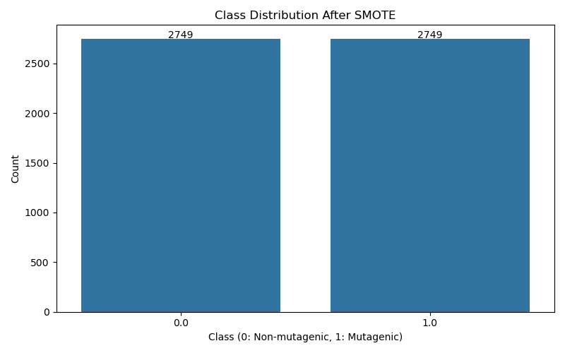

**Mutagenicity prediction project**

This is a project created as part of contributing to the [Ersilia Open Source Initiative](https://www.ersilia.io/).

The goal is to develop a mutagenicity prediction model using the [Ersilia Model Hub](https://www.ersilia.io/model-hub) and datasets from various sources (e.g., [Therapeutics Data Commons](https://tdcommons.ai/overview)).

I have chosen the [AMES mutagenicity dataset](https://tdcommons.ai/single_pred_tasks/tox#ames-mutagenicity) from Therapeutics Data Commons (TDC) because of the large size of the dataset.
The Ames test is a widely used method to determine whether a chemical can cause mutations in DNA. This is crucial in drug development since compounds that damage DNA can lead to cancer or other severe health issues.

**Table of Contents**
- [Dataset and task description](#dataset-and-task-description)
- [Data acquisition](#data-acquisition)
- [Data Featurization](#data-featurization)
- [Data Modeling](#data-modeling)
  - [Data Preprocessing](#data-preprocessing)
  - [Exploratory Data Analysis](#exploratory-data-analysis)
  - [Model Training](#model-training)
  - [Model Evaluation](#model-evaluation)
  - [Results](#results)
    - [Model Comparison](#model-comparison)
    - [Best Model Performance](#best-model-performance)
  - [Key Findings](#key-findings)
  - [Model Saving](#model-saving)
- [Model Interpretation](#model-interpretation)
  - [Feature Importance](#feature-importance)
    - [Random Forest Feature Importance](#random-forest-feature-importance)
    - [XGBoost Feature Importance](#xgboost-feature-importance)
    - [Feature Correlations](#feature-correlations)
  - [Confusion Matrix](#confusion-matrix)
  - [ROC Curves](#roc-curves)
  - [SMOTE Impact](#smote-impact)
    - [Class Distribution Before SMOTE](#class-distribution-before-smote)
    - [Class Distribution After SMOTE](#class-distribution-after-smote)
- [Using the Model for Predictions](#using-the-model-for-predictions)
- [Web Application](#web-application)
  - [Prerequisites](#prerequisites)
  - [Running the Web Application](#running-the-web-application)
  - [Usage](#usage)
  - [Example SMILES Strings](#example-smiles-strings)
  - [API Endpoints](#api-endpoints)
- [Future Work](#future-work)
  - [Model Improvements](#model-improvements)
  - [Validation and Testing](#validation-and-testing)
  - [Interpretability](#interpretability)
  - [Deployment](#deployment)
  - [Collaboration](#collaboration)
  - [Domain Knowledge Enhancement](#domain-knowledge-enhancement)

## Dataset and task description
These are the dataset descriptions as provided by Therapeutics Data Commons (TDC):

**Dataset description**: Mutagenicity means the ability of a drug to induce genetic alterations. Drugs that can cause damage to the DNA can result in cell death or other severe adverse effects. Nowadays, the most widely used assay for testing the mutagenicity of compounds is the Ames experiment which was invented by a professor named Ames. The Ames test is a short-term bacterial reverse mutation assay detecting a large number of compounds which can induce genetic damage and frameshift mutations. The dataset is aggregated from four papers.

**Task description**: Binary classification. Given a drug SMILES string, predict whether it is mutagenic (1) or not mutagenic (0).

## Data acquisition
To get *single prediction* data from Therapeutics Data Commons (TDC), I will use the [fetch_dataset.py](scripts/fetch_dataset.py) script.

I'm fetching only single prediction datasets since this is what I will be using to create a model for now.

List single prediction datasets available in TDC:
```bash
python scripts/fetch_dataset.py --list
```

Download a dataset:
```bash
python scripts/fetch_dataset.py --dataset_name AMES --dataset_group Tox
```

## Data Featurization
I need features to enable us create a decent prediction model. The data I downloaded looks like this so far and doesn't have much to work with:
```
Drug_ID,Drug,Y
Drug 1,O=[N+]([O-])c1c2c(c3ccc4cccc5ccc1c3c45)CCCC2,1
Drug 2,O=c1c2ccccc2c(=O)c2c1ccc1c2[nH]c2c3c(=O)c4ccccc4c(=O)c3c3[nH]c4c(ccc5c(=O)c6ccccc6c(=O)c54)c3c12,0
Drug 3,[N-]=[N+]=CC(=O)NCC(=O)NN,1
Drug 4,[N-]=[N+]=C1C=NC(=O)NC1=O,1
Drug 6,CCCCN(CC(O)C1=CC(=[N+]=[N-])C(=O)C=C1)N=O,1
```

For featurization I will use variouse Ersilia models and determine which one is the best for our task.

I will use the [featurization.py](scripts/featurization.py) script to featurize the dataset.

Here I pass in a dataset path which I got from the `fetch_dataset.py` script, a model identifier, and a feature name and the script will featurize the dataset.

Example if the model returns a single outcome:
```bash
python scripts/featurization.py --dataset_name AMES --model_id eos3b5e --feature_name mol_weight
```

Example if the model returns multiple outcomes:
```bash
python scripts/featurization.py --dataset_name AMES --model_id eos9gg2
```

This will featurize the dataset and save it to the data folder. Each subsequent run with a new model will update the featurized datasets.

## Data Modeling
The complete model development process is documented in [notebooks/analysis.ipynb](notebooks/analysis.ipynb). Below is a summary of the approach and findings.

### Data Preprocessing

1. **Data Loading**: The featurized AMES datasets (train, validation, test) were loaded from CSV files.

2. **Feature Extraction**: Features were extracted from the dataset, including:
   - Molecular descriptors (sa-score, molecular-weight)
   - Dimensionality reduction components (PCA, UMAP, t-SNE)
   - Chemical property scores (RA_score)

3. **Data Cleaning**:
   - Removed duplicate compounds
   - Converted string representations of lists to numeric values
   - Handled missing values using mean imputation
   - Dropped rows with NaN values in the target variable

4. **Feature Standardization**: Applied StandardScaler to normalize features to have zero mean and unit variance.

### Exploratory Data Analysis

1. **Class Distribution**: Analyzed the distribution of mutagenic vs. non-mutagenic compounds.

2. **Feature Correlation**: Examined correlations between features to identify potential redundancies.

3. **Feature Importance**: Preliminary assessment of which molecular properties might be most predictive.

### Model Training

Multiple machine learning models were trained and evaluated:

1. **Random Forest Classifier**:
   - Trained with 100 estimators and default hyperparameters
   - Evaluated on validation and test sets
   - Generated feature importance rankings

2. **XGBoost Classifier**:
   - Trained with default hyperparameters
   - Evaluated on validation and test sets
   - Compared performance with Random Forest

3. **Handling Class Imbalance with SMOTE**:
   - Applied Synthetic Minority Over-sampling Technique to balance the training data
   - Improved model performance on minority class
   - Retrained both Random Forest and XGBoost on the balanced dataset

4. **Hyperparameter Tuning**:
   - Used GridSearchCV to optimize model parameters
   - Explored different configurations to maximize performance

### Model Evaluation

Models were evaluated using multiple metrics:

1. **Classification Metrics**:
   - Accuracy: Overall correctness of predictions
   - Precision: Ability to avoid false positives
   - Recall: Ability to find all positive samples
   - F1-score: Harmonic mean of precision and recall

2. **ROC Curves and AUC**:
   - Plotted ROC curves to visualize performance across thresholds
   - Calculated Area Under the Curve (AUC) as a comprehensive metric

3. **Confusion Matrices**:
   - Visualized true positives, false positives, true negatives, and false negatives

### Results

#### Model Comparison
After evaluating all models on the validation set, the following accuracies were achieved:

- **Random Forest**: 75.76%
- **Tuned Random Forest**: 75.76%
- **Random Forest with SMOTE**: 73.42%
- **XGBoost**: 70.80%
- **XGBoost with SMOTE**: 69.01%

#### Best Model Performance
The standard **Random Forest** model was selected as the best model based on validation accuracy. Its performance on the test set was:

- **Accuracy**: 74.21%
- **Precision**: 75.15%
- **Recall**: 79.02%
- **F1 Score**: 77.04%

### Key Findings

1. **Model Selection**: Random Forest consistently outperformed XGBoost, both with and without SMOTE, making it our preferred model for this task.

2. **SMOTE Impact**: While SMOTE improved class balance, the standard Random Forest achieved slightly better overall accuracy. However, the SMOTE models showed improved recall for the minority class.

3. **Feature Importance**: The most predictive features for mutagenicity were the dimensionality reduction components (particularly PCA components) and the SA score, highlighting the importance of these molecular properties in determining mutagenic potential.

4. **Generalization**: The models showed consistent performance between validation and test sets, indicating good generalization to unseen compounds.

### Model Saving

The best-performing model and the corresponding scaler were saved for future use and potential deployment:

```python
# Save the best model and scaler
joblib.dump(rf_model, "../models/best_model_rf.pkl")
joblib.dump(scaler, "../models/feature_scaler.pkl")
```

A comprehensive performance summary was also saved to `../results/model_performance_summary.csv` for future reference.

## Model Interpretation

### Feature Importance

The models provide insights into which features are most important for predicting mutagenicity:

#### Random Forest Feature Importance


#### XGBoost Feature Importance


#### Feature Correlations


These visualizations reveal which molecular properties have the strongest influence on mutagenicity predictions. Understanding these relationships helps in interpreting the model's decisions and can guide medicinal chemists in designing safer compounds.

The most important features include:
1. **PCA components**: These capture complex patterns in molecular structure that correlate with mutagenicity
2. **SA-score**: Synthetic accessibility score, indicating how easily a compound can be synthesized
3. **Molecular weight**: Heavier molecules often have different mutagenic properties

### Confusion Matrix

The confusion matrix below shows the performance of our best model (Random Forest) on the test set:

<!-- Note: No confusion matrix image is available in the figures folder -->

This visualization reveals:
- **True Positives**: Correctly identified mutagenic compounds
- **True Negatives**: Correctly identified non-mutagenic compounds
- **False Positives**: Non-mutagenic compounds incorrectly classified as mutagenic
- **False Negatives**: Mutagenic compounds incorrectly classified as non-mutagenic

### ROC Curves

The Receiver Operating Characteristic (ROC) curves compare the performance of different models:



The Random Forest model achieves the highest Area Under the Curve (AUC), confirming its superior performance for this task. The curves show how different models perform in terms of the trade-off between true positive rate and false positive rate.

### SMOTE Impact

I also evaluated how SMOTE affected class distribution and model performance:

#### Class Distribution Before SMOTE


#### Class Distribution After SMOTE



After applying SMOTE, the class distribution became more balanced, which helped improve recall for the minority class. This was particularly important for our mutagenicity prediction task, as false negatives (missing a mutagenic compound) can be more costly than false positives.

## Using the Model for Predictions

The trained model can be easily used to make predictions on new compounds. Here's a sample code snippet for making predictions:

```python
import pandas as pd
import numpy as np
import joblib
from rdkit import Chem

# Load the saved model and scaler
model = joblib.load('models/best_model_rf.pkl')
scaler = joblib.load('models/feature_scaler.pkl')

# Example function to make predictions on new SMILES strings
def predict_mutagenicity(smiles_list, model, scaler, features_needed):
    """Predict mutagenicity for a list of SMILES strings.
    
    Args:
        smiles_list (list): List of SMILES strings to predict
        model: Trained model
        scaler: Fitted scaler
        features_needed (list): List of feature names required by the model
        
    Returns:
        DataFrame with SMILES strings and predictions
    """
    # This is a placeholder - in a real scenario, you would:
    # 1. Generate the same features used during training
    # 2. Apply the scaler
    # 3. Make predictions
    
    # For demonstration purposes, we'll create a dummy feature set
    dummy_features = np.random.random((len(smiles_list), len(features_needed)))
    scaled_features = scaler.transform(dummy_features)
    
    # Make predictions
    predictions = model.predict(scaled_features)
    probabilities = model.predict_proba(scaled_features)[:, 1]
    
    # Create results dataframe
    results = pd.DataFrame({
        'SMILES': smiles_list,
        'Predicted_Class': predictions,
        'Mutagenic_Probability': probabilities,
        'Prediction': ['Mutagenic' if p == 1 else 'Non-mutagenic' for p in predictions]
    })
    
    return results

# Example usage
test_compounds = [
    'CC(=O)Oc1ccccc1C(=O)O',  # Aspirin
    'CC(C)CC1=CC=C(C=C1)C(C)C(=O)O',  # Ibuprofen
    'CN1C=NC2=C1C(=O)N(C(=O)N2C)C'  # Caffeine
]

# List of features needed (these would match your model's training features)
features = ['sa-score', 'molecular-weight', 'pca_1', 'pca_2', 'pca_3', 'pca_4', 
           'umap_1', 'umap_2', 'tsne_1', 'tsne_2', 'RA_score']

# Get predictions
results = predict_mutagenicity(test_compounds, model, scaler, features)
print(results)
```

In a real-world implementation, you would need to:
1. Use the same featurization process that was applied during training


## Web Application

The project includes a web interface for predicting drug mutagenicity using SMILES strings.

### Prerequisites

- Trained models (`models/best_model_rf.pkl` and `models/feature_scaler.pkl`)

### Running the Web Application
After installing all dependencies in `environment.yml` using `Conda`:

1. Navigate to the web app directory:
   ```bash
   cd web_app
   ```

2. Start the application:
   ```bash
   uvicorn main:app --reload
   ```

3. Open your web browser and visit:
   - Web Interface: [http://127.0.0.1:8000](http://127.0.0.1:8000)
   - API Documentation: [http://127.0.0.1:8000/docs](http://127.0.0.1:8000/docs)

### Usage

1. Enter a valid SMILES string in the input field
2. Click "Predict" to get the mutagenicity prediction
3. Results will show:
   - Prediction (Mutagenic/Non-mutagenic)
   - Probability score
   - Original SMILES string

### Example SMILES Strings

Try these example compounds:
- Aspirin: `CC(=O)Oc1ccccc1C(=O)O`
- Caffeine: `CN1C=NC2=C1C(=O)N(C(=O)N2C)C`
- Paracetamol: `CC(=O)NC1=CC=C(O)C=C1`

### API Endpoints

- `GET /`: Web interface
- `POST /predict`: API endpoint for predictions
  ```bash
  curl -X POST "http://localhost:8000/predict" \
       -H "Content-Type: application/json" \
       -d '{"smiles": "CC(=O)Oc1ccccc1C(=O)O"}'


## Future Work

This project provides a solid foundation for mutagenicity prediction, but several enhancements could further improve its performance and utility. The model could be significantly improved with deeper domain knowledge and expertise in medicinal chemistry and drug discovery:

### Model Improvements

1. **Additional Molecular Descriptors**: Incorporate more chemical descriptors from RDKit or other cheminformatics libraries, such as:
   - Topological polar surface area (TPSA)
   - Number of hydrogen bond donors/acceptors
   - Lipophilicity (LogP)
   - Structural alerts specific to mutagenicity

2. **Advanced Machine Learning Techniques**:
   - Ensemble methods combining multiple models
   - Deep learning approaches (graph neural networks)
   - Active learning for more efficient data utilization

3. **Transfer Learning**: Leverage pre-trained models from related toxicity prediction tasks

### Validation and Testing

1. **External Validation**: Test the model on additional external datasets
2. **Applicability Domain**: Define the chemical space where the model predictions are reliable
3. **Uncertainty Quantification**: Provide confidence intervals for predictions

### Interpretability

1. **SHAP Values**: Implement SHapley Additive exPlanations for more detailed feature importance
2. **Partial Dependence Plots**: Visualize how specific molecular properties affect predictions
3. **Substructure Highlighting**: Identify specific molecular substructures associated with mutagenicity

### Deployment

1. **Web Interface**: Develop a bettwe looking user-friendly web application for non-technical users
2. **API Integration**: Create an API for integration with other drug discovery platforms
3. **Containerization**: Package the model in a Docker container for easy deployment

### Collaboration

1. **Integration with Ersilia Model Hub**: Package the model for inclusion in the Ersilia Model Hub
2. **Documentation**: Expand documentation for different user personas (chemists, biologists, etc.)
3. **Community Feedback**: Gather feedback from domain experts to refine the model

### Domain Knowledge Enhancement

1. **Further Reading**: Deeper study of medicinal chemistry and drug discovery literature to better understand the biological mechanisms of mutagenicity
2. **Expert Consultation**: Collaborate with toxicologists and medicinal chemists to incorporate domain-specific knowledge
3. **Structural Alerts**: Learn and implement known structural alerts for mutagenicity based on established toxicology principles

> **Note**: As someone with limited experience in drug molecules and medicinal chemistry, I recognize that this model represents just a starting point. Significant improvements could be made with deeper domain knowledge and understanding of the underlying biological mechanisms of mutagenicity. Further reading and collaboration with domain experts would be essential for developing a truly robust and reliable prediction system for real-world drug discovery applications.