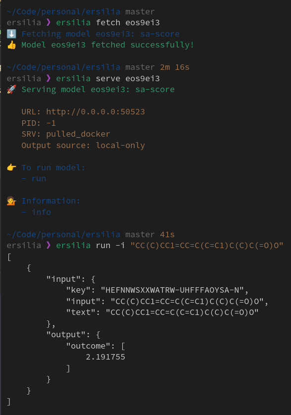
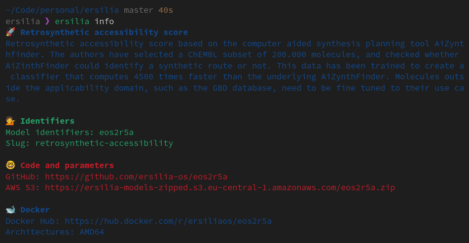

## Motivation Letter

Hello,

I am Antony Nyagah, a software developer and data enthusiast with an interest in healthcare related projects. I have gained most of my skills from maintaining and working on projects that help labs perform external quality assessment. Due to the nature of how I gained my skills and my interest in using technology to make healthcare more equitable, Ersilia's goals have caught my eye. I'd love to help in furthering the democratize of biomedical research with Ersilia.

My skills are mostly in Python and JavaScript with a focus on backend development and data. Apart from writing and maintaining code I can deploy said code using Docker and CICD pipelines on either GitLab or GitHub with minimal issues. I also have a data science certification from ALX Africa and a data analyst certification from Datacamp. This is the perfect opportunity to put what I learned into practice. Having run the gamut of software development, I feel I have the necessary skills to aid in furthering Ersilia's goals while also learning of how to further improve healthcare in my country and eventually worldwide.

My main goals are to learn how to implement models that produce accurate results, learn from the community and to implement what I have learned within the health sector in my country. The implementation part could be either through educating others on what Ersilia is doing and how it can help labs or actually getting down to it and working on some models with help from people far more knowledgeable than I am. 

I look forward to getting started on the contributions.

Best regards,    
Antony Nyagah

## Install the Ersilia Model Hub and successfully run models!
I have sucessfully installed the Ersilia Model Hub by following the instructions at https://ersilia.gitbook.io/ersilia-book/ersilia-model-hub/installation.

The models I ran are `eos3b5e`, `eos2r5a`, and `eos9ei3`. These will be run on the Ibuprofen SMILES string as input so the command should be:
1. `ersilia fetch EOS-ID` - fetch the model we're going to use
2. `ersilia serve EOS-ID` - serve the model
3. `ersilia run -i "CC(C)CC1=CC=C(C=C1)C(C)C(=O)O"` - send the ibuprofen smiles string as input

The results for each model are as follow:
* `eos3b5e`: molecular-weight

* `eos2r5a`: retrosynthetic-accessibility

* `eos9ei3`: sa-score

## System settings
My system settings are as follows:

-  **OS**: *Fedora*
- **Python**: *3.12.9*
- **Docker**: *28.0.1*
- **Docker** *Compose: 2.33.1*

## Explained completed tests of Ersilia
The models I ran can receive SMILES which are defined as:

> Simplified Molecular Input Line Entry System (SMILES) which are used to translate a chemical's three-dimensional structure into a string of symbols that is easily understood by computer software.
> --- https://www.epa.gov/sites/default/files/2015-05/documents/appendf.pdf

After installing Ersilia, access to ready-to-use machine learning models for drug discovery and global health is gained.

The models to run for the task were:
1. `eos3b5e` - Molecular weight
    - The model is simply an implementation of the function Descriptors.MolWt of the chemoinformatics package RDKIT. It takes as input a small molecule (SMILES) and calculates its molecular weight in g/mol.
    - 
    - The molecular weight of Ibuprofen ended up being `206.28499999999997`.

2. `eos2r5a` - Retrosynthetic accessibility score
    - Retrosynthetic accessibility score based on the computer aided synthesis planning tool AiZynthfinder. The authors have selected a ChEMBL subset of 200.000 molecules, and checked whether AiZinthFinder could identify a synthetic route or not. This data has been trained to create a classifier that computes 4500 times faster than the underlying AiZynthFinder. Molecules outside the applicability domain, such as the GBD database, need to be fine tuned to their use case.
    - 
    - The retrosynthetic accessibility score of Ibuprofen ended up being: `0.9899624`.

3. `eos9ei3` - Synthetic accessibility score
    - Estimation of synthetic accessibility score (SAScore) of drug-like molecules based on molecular complexity and fragment contributions. The fragment contributions are based on a 1M sample from PubChem and the molecular complexity is based on the presence/absence of non-standard structural features. It has been validated comparing the SAScore and the estimates of medicinal chemist experts for 40 molecules (r2 = 0.89). The SAScore has been contributed to the RDKit Package.
    - 
    - The synthetic accessibility score of Ibuprofen ended up being: `2.191755`.

To view what models I have downloaded I ran `ersilia catalog`:

The `ersilia fetch` command uses Docker to get the required image and create containers:

The `fetch` command can be used to pull from various sources like s3 and DockerHub but you can also just use Docker itself to pull models you need:

